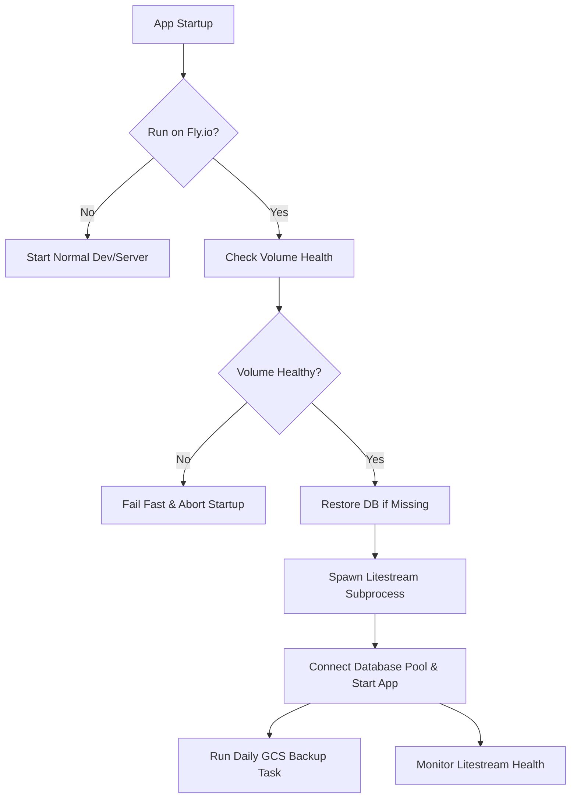

# Fly.io Deployment, Backups, and Auto-Recovery Guide

This guide details the architecture, configuration, operation, and recovery procedures for running the fullstack web application on Fly.io. It is designed to explain **why** each step is performed and **how** the Fly.io platform manages stateful containers.

---

## 1. Architectural Overview

Running SQLite in a cloud environment requires careful orchestration. Because Fly.io volumes are local, physical NVMe SSDs, they do not replicate data across hosts automatically. If the hardware host fails, the volume data is inaccessible. 

We use a **two-tier durability strategy** combined with Fly.io's replication infrastructure to achieve zero-operator auto-recovery:

1. **Tier 1: Real-time Replication (Litestream)**: Streams SQLite WAL (Write-Ahead Log) changes to an S3-compatible bucket (RPO < 1s).
2. **Tier 2: Daily Snapshots (GCS)**: Executes a daily SQLite `VACUUM INTO` snapshot uploaded to Google Cloud Storage for disaster recovery.
3. **Auto-Recovery (Fly Standby VM)**: Uses Fly.io's platform Standbys feature to boot a secondary standby VM on an empty volume automatically if the primary host hardware fails. The new VM auto-restores the database via Litestream.



---

## 2. Initial Infrastructure & Configuration Setup

### A. App Configuration (`fly.toml`)
Your [fly.toml](file:///workspaces/svelaxum/fly.toml) is configured to support persistent volume mounts and HTTP health checking on startup:

```toml
app = "svelaxum"
primary_region = "ord"

[build]
  dockerfile = "Dockerfile.prod"

[mounts]
  source = "svelaxum_data"
  destination = "/data"

[http_service]
  internal_port = 3000
  force_https = true
  auto_stop_machines = false
  auto_start_machines = true
  min_machines_running = 1

[[http_service.checks]]
  interval = "30s"
  timeout = "5s"
  grace_period = "30s"
  method = "GET"
  path = "/api/health"

[restart]
  policy = "always"
```

#### Detailed Configuration Breakdown:
* **`[mounts]` Section**: Tells Fly to look for a volume named `svelaxum_data` in the deployment region and mount it at `/data` inside the container before the app boots.
* **`min_machines_running = 1`**: Ensures the Fly proxy keeps at least one VM active.
* **`auto_start_machines = true`**: Allows Fly's load balancer to automatically start stopped VMs if traffic arrives.
* **`[[http_service.checks]]`**: A platform-level health check. Fly pings `/api/health` every 30 seconds. If it fails, Fly takes the node out of the load balancer pool.

### B. Boot Order & Health Checks
The server's initialization sequence ensures data integrity:
1. **Startup Check**: [recovery.rs](file:///workspaces/svelaxum/backend/fly/recovery.rs) executes `check_volume_and_self_heal()`. If `/data` is on the ephemeral root device or is read-only, it fails fast and exits with code `1`.
2. **Litestream Restore**: [litestream.rs](file:///workspaces/svelaxum/backend/fly/litestream.rs) runs `init_litestream()`. If the database file is missing from `/data`, it executes `litestream restore -if-replica-exists` to rebuild the DB.
3. **Service Launch**: Axum starts serving traffic and monitors Litestream health under `LITESTREAM_PROCESS` using `is_litestream_healthy()`.

---

## 3. External Backup Setup & Secrets Configuration

Before deploying, you must provision your external cloud storage buckets to store replication frames.

### Tier 1: Litestream Setup (Fly.io Tigris Storage)
Fly.io provides a fully integrated, S3-compatible object storage service called **Tigris**. You can provision a Tigris bucket directly from your command line without signing up for external cloud services.

1. **Create the Bucket**: Run the following command from your project directory (make sure your Fly application has already been initialized via `fly launch` first):
   ```bash
   fly storage create
   ```
   *Follow the prompts to name the bucket (e.g., `svelaxum-replica`).*
2. **Examine Automated Secrets**: This command automatically creates the bucket and injects the standard AWS credentials into your Fly app's secrets list:
   * `AWS_ACCESS_KEY_ID` (Read by Litestream)
   * `AWS_SECRET_ACCESS_KEY` (Read by Litestream)
   * `BUCKET_NAME` (Tigris generated bucket name)
3. **Link to Litestream Variables**:
   Because [litestream.yml](file:///workspaces/svelaxum/litestream.yml) looks for `LITESTREAM_ENDPOINT` and `LITESTREAM_BUCKET`, bind these variables to your new Tigris details:
   ```bash
   # Retrieve your BUCKET_NAME secret if you forgot the generated name:
   fly secrets list
   
   # Set the Litestream-specific variables targeting the Tigris endpoint:
   fly secrets set \
     LITESTREAM_ENDPOINT="https://fly.storage.tigris.dev" \
     LITESTREAM_BUCKET="<your-generated-tigris-bucket-name>"
   ```

---

### Tier 2: GCS Daily Backup Setup
For disaster recovery, configure a Google Cloud Storage bucket and a Google Service Account (SA) key:

1. Create a GCS bucket (e.g., `svelaxum-disaster-recovery`).
2. Create a Google Service Account with `Storage Object Admin` or `Storage Object Creator` permissions.
3. Download the Service Account private key in JSON format.
4. Base64-encode the entire JSON file:
   ```bash
   cat gcs-sa-key.json | base64 -w 0
   ```

*Note: The GCS backup routine ([backup.rs](file:///workspaces/svelaxum/backend/fly/backup.rs)) uses a checkpoint file (`/data/.last_gcs_backup`) to guarantee GCS snapshots are triggered exactly once every 24 hours regardless of container restarts.*

---

## 4. Step-by-Step Initial Deployment Guide (Staging-First)

To prevent data loss and verify configuration files, always deploy to **Staging** before launching in **Production**.

### Step 1: Login and App Initialization
Initialize your application on the Fly.io platform:

1. **Login to the Fly CLI**:
   ```bash
   fly auth login
   ```
2. **Launch the App Configuration**:
   Create the application identity on Fly.io without deploying it immediately:
   ```bash
   fly launch --no-deploy
   ```
   *This command parses your local [fly.toml](file:///workspaces/svelaxum/fly.toml) file, registers your primary app name (e.g., `svelaxum`) on your Fly account, and configures the default region (e.g., `ord`).*

---

### Step 2: Set up the Staging Environment
Staging lets you safely test database migrations and configuration updates on an isolated environment before modifying production.

1. **Create the Staging App**:
   Register a second, distinct application name specifically for staging:
   ```bash
   fly apps create svelaxum-staging
   ```
2. **Create the Staging Storage Volume**:
   Provision a 3GB storage volume in your primary region. The name **must** match the `source` name in your `fly.toml` (`svelaxum_data`) for the mount to bind correctly:
   ```bash
   fly volume create svelaxum_data --app svelaxum-staging --region ord --size 3
   ```
3. **Set Staging-Specific Backup Secrets**:
   Point your staging app to a **separate staging replication bucket** (never use your production bucket, otherwise staging writes will pollute and corrupt your production backups):
   ```bash
   fly secrets set --app svelaxum-staging \
     LITESTREAM_ACCESS_KEY_ID="your_access_key" \
     LITESTREAM_SECRET_ACCESS_KEY="your_secret_key" \
     LITESTREAM_REPLICA_BUCKET="your_staging_bucket_name" \
     LITESTREAM_REPLICA_ENDPOINT="your_s3_endpoint_url"
   ```

4. **One-Time Production Data Restore to Staging (Safe Copy)**:
   Since our production runtime container is built on a distroless image (**[Dockerfile.prod](file:///workspaces/svelaxum/Dockerfile.prod)**), it has no shell (`bash`/`sh`). We cannot SSH in to copy files. 
   
   Instead, we boot a **temporary single-use machine**, override its entrypoint to run Litestream directly, mount our staging volume, perform a read-only restore using the production bucket credentials, and destroy the temporary VM:

   * **Find the latest built image tag**:
     ```bash
     fly image show --app svelaxum
     ```
     *(Take note of the registry image URI, e.g., `registry.fly.io/svelaxum:deployment-01J0Z...`).*

   * **Run the one-off restoration container**:
     ```bash
     fly machine run \
       --app svelaxum-staging \
       --region ord \
       --entrypoint "/usr/local/bin/litestream" \
       --volume svelaxum_data:/data \
       --rm \
       -e LITESTREAM_ACCESS_KEY_ID="prod_access_key" \
       -e LITESTREAM_SECRET_ACCESS_KEY="prod_secret_key" \
       -e LITESTREAM_REPLICA_BUCKET="prod_bucket_name" \
       -e LITESTREAM_REPLICA_ENDPOINT="prod_s3_endpoint_url" \
       <your-registry-image-uri> \
       restore -o /data/svelaxum.db /data/svelaxum.db
     ```
     *Explanation of arguments:*
     * `--entrypoint "/usr/local/bin/litestream"`: Bypasses the application binary and runs Litestream directly.
     * `--volume svelaxum_data:/data`: Mounts the staging volume to the `/data` directory.
     * `--rm`: Instructs Fly to automatically destroy the temporary VM once the restore finishes.
     * `-e KEYS`: Temporary environment variables passed only to this VM so it can read from your production bucket.

5. **Deploy and Validate Staging**:
   Deploy your current codebase to the staging app:
   ```bash
   # Run this from your project root directory (where fly.toml is located)
   fly deploy --app svelaxum-staging
   ```
   *Note: The `--app svelaxum-staging` flag explicitly overrides the default app name defined in your `fly.toml` file.*

   Verify staging is healthy by checking the logs (`fly logs --app svelaxum-staging`) and visiting the staging URL.

---

### Step 3: Set up the Production Environment
Once staging has been verified, deploy your production environment.

1. **Create the Production Volume**:
   ```bash
   fly volume create svelaxum_data --region ord --size 3
   ```
2. **Set Production Secrets**:
   Set the credentials for your production Litestream and GCS backup buckets:
   ```bash
   fly secrets set \
     LITESTREAM_ACCESS_KEY_ID="your_prod_access_key" \
     LITESTREAM_SECRET_ACCESS_KEY="your_prod_secret_key" \
     LITESTREAM_REPLICA_BUCKET="your_prod_bucket_name" \
     LITESTREAM_REPLICA_ENDPOINT="your_prod_s3_endpoint_url" \
     GCS_BACKUP_BUCKET="svelaxum-disaster-recovery" \
     GCS_SA_KEY_BASE64="<your_base64_encoded_json_key>"
   ```
3. **Deploy to Production**:
   ```bash
   # Run this from your project root directory (where fly.toml is located)
   fly deploy
   ```
   *Note: Because no `--app` override flag is specified, the Fly CLI automatically reads the default app name (`app = "svelaxum"`) from the local `fly.toml` and targets your production application.*

---

### Step 4: Configure Zero-Operator Auto-Recovery (Fly Standbys)
Because Fly.io volumes are tied to physical hardware, a host crash prevents the active volume from being read. We provision a **Warm Standby Machine** on an independent standby volume to automate recovery.

1. **Get Primary Machine ID**:
   ```bash
   fly machine list
   ```
   Identify your active machine ID (referred to here as `<primary-machine-id>`).

2. **Create Standby Volume**:
   Provision a second volume in the same region under the same name:
   ```bash
   fly volume create svelaxum_data --region ord --size 3
   ```

3. **Provision the Standby Machine**:
   Clone your primary machine, bind it to the standby volume, and register it as a standby. It will remain in a `stopped` state until needed:
   ```bash
   fly machine clone <primary-machine-id> --standby-for <primary-machine-id> --region ord
   ```

#### Failover Event Sequence (Automatic):
* If the primary machine's host server fails, the machine goes offline.
* Fly.io's Edge Proxy detects the failure and automatically boots the standby machine.
* The standby machine mounts the empty standby volume.
* On boot, `init_litestream()` runs, detects no database file is present, and runs `litestream restore -if-replica-exists` to reconstruct your database from the replica bucket.
* Axum launches and the app resumes serving traffic.

---

## 5. Safely Performing a New Release

To deploy new code and database migrations without risking data corruption or downtime:

### Step 1: Pre-Release Database Backup
Before deploying a new version, force a transactionally consistent snapshot of the live database directly to your S3 replica bucket:

```bash
# 1. Identify the running machine ID
fly machine list

# 2. Execute the litestream snapshot binary directly inside the VM
fly machine exec <primary-machine-id> /usr/local/bin/litestream snapshot /data/svelaxum.db
```
*Note: This commands bypasses the shell, opens a transaction-aware read of the SQLite database and its WAL file, and uploads a consistent recovery snapshot to your cloud bucket.*

### Step 2: Run Automated Tests & Linters Locally
```bash
cargo test --workspace --features fly
cargo clippy --workspace --all-targets --features fly
```

### Step 3: Deploy to Staging First
Deploy and test the release on your staging app:
```bash
fly deploy --app svelaxum-staging
```
Verify logs (`fly logs --app svelaxum-staging`) and confirm health checks pass.

### Step 4: Promote to Production
Deploy the code to production:
```bash
fly deploy
```

---

## 6. Operations & Manual Recovery

### Restoring the Database Locally (Disaster Recovery)
If you need to restore your database locally from your Litestream replica:

1. Ensure the correct Litestream environment variables are set in your shell:
   ```bash
   export LITESTREAM_ACCESS_KEY_ID="your_access_key"
   export LITESTREAM_SECRET_ACCESS_KEY="your_secret_key"
   ```
2. Run the restore command using the Litestream CLI:
   ```bash
   litestream restore -o /local/path/to/restored.db -replica-endpoint "your_s3_endpoint_url" -replica-bucket "your_bucket_name" /data/svelaxum.db
   ```

### Verifying Backup Health
Check your application logs to confirm that both backup tiers are active:
```bash
# Verify Litestream replication is healthy
fly logs | grep "starting_litestream_replication"

# Verify GCS backup ticks
fly logs | grep "starting_scheduled_gcs_backup"
```

---

## 7. Rollbacks & Point-in-Time Recovery (PITR)

If a release is deployed successfully but a migration bug or runtime data corruption is discovered post-release, you must roll back the code and restore the database to its pre-release state.

### A. Performing Code Rollback
Roll back your application container image to the previous healthy release:
```bash
# 1. List previous releases
fly releases

# 2. Roll back to the specific healthy release number
fly release rollback <release-number>
```

### B. Restoring the DB to the Pre-Release Timestamp (PITR)
To throw away the corrupted migration changes and restore the database exactly to the timestamp prior to the deployment:

1. Locate the timestamp right before the deploy (e.g., `2026-06-20T12:25:00Z`).
2. Run the restore command on a temporary single-use machine targeting your production volume:
   ```bash
   fly machine run \
     --region ord \
     --entrypoint "/usr/local/bin/litestream" \
     --volume svelaxum_data:/data \
     --rm \
     -e LITESTREAM_ACCESS_KEY_ID="prod_access_key" \
     -e LITESTREAM_SECRET_ACCESS_KEY="prod_secret_key" \
     -e LITESTREAM_REPLICA_BUCKET="prod_bucket_name" \
     -e LITESTREAM_REPLICA_ENDPOINT="prod_s3_endpoint_url" \
     <your-registry-image-uri> \
     restore -timestamp "2026-06-20T12:25:00Z" -o /data/svelaxum.db /data/svelaxum.db
   ```
3. Restart your primary production machine to load the restored database state:
   ```bash
   fly machine restart <primary-machine-id>
   ```
