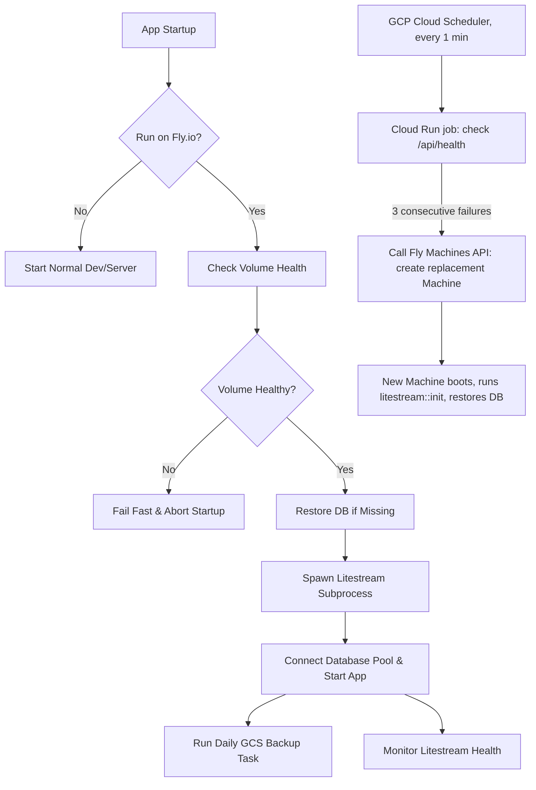

# Fly.io Deployment, Backups, and Recovery Guide

This guide covers deploying svelaxum to Fly.io with SQLite, setting up a two-tier backup strategy, and building real automated recovery using GCP as an independent watchdog. It explains **why** each step exists and **what Fly.io actually does and doesn't do** — several commonly-repeated claims about Fly's "auto-recovery" features turn out not to apply to volume-backed apps, so this guide is explicit about where the boundary is.

---

## 1. Architectural Overview

Fly volumes are local NVMe disks, physically attached to one host. They are not replicated across hosts. If the host dies, the volume is gone with it. Fly's own docs are blunt about this: **"You'll only get one Machine with `fly launch` for processes or apps with volumes mounted. Volumes don't automatically replicate your data for you."** Fly does this on purpose — it has no way to know which of two independently-written volumes is "current," so it refuses to auto-scale volume-backed apps the way it does stateless ones.

This means there is **no Fly.io platform feature that automatically detects a dead host and re-routes traffic to a fresh Machine with restored data**. The "Standby Machines" feature people sometimes point to for this is explicitly built for _worker_ processes with **no `[http_service]` block** — `fly`'s own docs describe it as being for apps "running tools like cron that don't require local storage or accept external requests," and a failing HTTP health check **does not** restart a Machine or trigger anything automatically — it only takes the Machine out of the Fly Proxy routing pool. If both Machines behind a service are unhealthy, requests just hang.

Given that, this guide gives you the most automated setup actually achievable with your architecture:

1. **Tier 1: Real-time replication (Litestream → Tigris)**. Streams SQLite WAL changes to Fly's S3-compatible storage. Recovery point objective (RPO) is seconds, not hours.
2. **Tier 2: Daily snapshots (GCS)**. A `VACUUM INTO` snapshot uploaded to Google Cloud Storage daily, independent of Tigris, as a second disaster-recovery tier in case the Tigris bucket or replication itself is ever compromised.
3. **Automated recovery watchdog (GCP Cloud Scheduler + Cloud Run)**. Since Fly has no built-in mechanism to detect "this host is dead, boot a replacement," you run a small watchdog **outside Fly** that polls `/api/health`, and on sustained failure, calls the Fly Machines API to provision a fresh Machine on a new volume. Because it lives in GCP — a separate provider, separate network, separate failure domain — it can act even if all of Fly's control plane in your region is degraded. This also reuses your existing GCS credits, so it doesn't add a new bill.



**Important honesty note:** even with the watchdog, this is not zero-downtime, instantaneous failover. There will be a gap between host failure and a new Machine being healthy — realistically low single-digit minutes, dominated by detection time plus Machine boot plus `litestream restore`. If you need sub-second failover with no data loss window, that requires a fundamentally different architecture (a real multi-writer-aware replicated database, or LiteFS with Consul — which Fly itself flags as unsupported beta software not meant for production reliance, and which is incompatible with autostop/autostart). For a solo project on SQLite, what's below is the most automation you can responsibly build without taking on that complexity.

---

## 2. Initial Infrastructure & Configuration Setup

### A. App Configuration (`fly.toml`)

```toml
app = "svelaxum"
primary_region = "fra"

[build]
  dockerfile = "Dockerfile.prod"

[mounts]
  source = "svelaxum_data"
  destination = "/data"

[http_service]
  internal_port = 3000
  force_https = true
  auto_stop_machines = "off"
  auto_start_machines = true
  min_machines_running = 1

[[http_service.checks]]
  interval = "30s"
  timeout = "5s"
  grace_period = "30s"
  method = "GET"
  path = "/api/health"

[[restart]]
  policy = "on-failure"
  retries = 10
  processes = ["app"]

[[vm]]
  size = "shared-cpu-1x"
  memory = "512mb"
  processes = ["app"]
```

#### Detailed Configuration Breakdown

- **`[mounts]`**: Tells Fly to find the volume named `svelaxum_data` in the deployment region and mount it at `/data` before the app starts.
- **`min_machines_running = 1`**: Keeps at least one Machine running; for a volume-backed app you can only sensibly run one Machine anyway (see Section 1), so this should always be `1`, never `0`.
- **`auto_start_machines = true`**: Lets the proxy start a stopped Machine on incoming traffic.
- **`[[http_service.checks]]`**: A platform health check. Fly pings `/api/health` every 30 seconds. If it fails, Fly stops routing to that Machine — **but does not restart, stop, or replace it**. This is the gap the watchdog (Section 5) fills.
- **`[restart] policy = "on-failure"`**: If your app process crashes (non-zero exit), Fly retries starting it on the _same_ Machine/volume, up to 10 times, before giving up. This handles app-level crashes — it does **not** help if the underlying host itself is gone, since the Machine can't restart on hardware that no longer exists.

### B. Boot Order & Health Checks

1. **Startup Volume & Litestream Initialization**: At startup (under the `fly` feature flag), [server::run](file:///workspaces/registrul/backend/server.rs#L82) calls [litestream::init](file:///workspaces/registrul/backend/fly/litestream.rs#L9-L66).
    - **Volume Check**: Internally, `is_volume_healthy()` is run to determine if `/data` sits on the ephemeral root device (by comparing device IDs of `/data` and `/`) or is read-only/unwritable. If unhealthy, it fails fast and exits with code `1`.
    - **Litestream Restore**: If the database file is missing from `/data` (e.g., this is a brand-new volume), it runs `litestream restore -if-replica-exists` to rebuild the DB from the Tigris replica.
        - **Fail-Safe Behavior**: If the restore command fails (returns a non-zero exit status due to network error, credential issue, etc.), the application **aborts startup** (`exit(1)`) to prevent starting with an empty database and causing silent data loss or split-brain/replica generation conflicts.
        - **First Run**: On a clean initial deployment where no replica exists, the `-if-replica-exists` flag causes the restore command to exit gracefully with code `0`. The application continues booting, SQLx creates the new database file, and the background `litestream replicate` process initializes the Tigris replica.
    - **Replication Process**: Spawns the `litestream replicate` subprocess in the background to replicate database updates.
2. **Service Launch & Daily Backup Task**: Axum starts serving HTTP traffic. Once the server is running, [server::start_background_cleanup_tasks](file:///workspaces/registrul/backend/server.rs#L106-L138) spawns the Tier 2 daily backup task via [backup::spawn_gcs_backup_task](file:///workspaces/registrul/backend/fly/backup.rs#L44-L83).
3. **Continuous Health Monitoring**: The `/api/health` endpoint ([router::health_check](file:///workspaces/registrul/backend/router.rs#L115-L140)) performs a standard database check (`SELECT 1`). If the `fly` feature is active, it also queries [litestream::is_litestream_healthy](file:///workspaces/registrul/backend/fly/litestream.rs#L80-L110) to confirm the replication subprocess is running.

This boot sequence is exactly what lets the watchdog in Section 5 work: any _fresh_ Machine that boots against a _fresh, empty_ volume will automatically self-restore from the replica without manual intervention. That part of your design is already correct — what was missing was the trigger to create that fresh Machine in the first place.

---

## 3. External Backup Setup & Secrets Configuration

### Tier 1: Litestream Setup (Fly.io Tigris Storage)

1. **Create the bucket** (run from your project directory, after `fly launch` has registered the app):

    ```bash
    fly storage create
    ```

    Follow the prompt to name the bucket (e.g. `svelaxum-replica`).

2. **What this actually sets.** `fly storage create` automatically sets **five** secrets on your app, not three:
    - `AWS_ACCESS_KEY_ID`
    - `AWS_SECRET_ACCESS_KEY`
    - `AWS_ENDPOINT_URL_S3` (always `https://fly.storage.tigris.dev`)
    - `AWS_REGION` (always `auto`)
    - `BUCKET_NAME`

    **Save the access key and secret immediately if shown in plain text in your terminal** — `fly secrets list` only shows hashes afterward, so if you lose them you'll need to rotate the bucket credentials, not just look them up.

3. **Map to the variable names your code expects.** Your `litestream.yml` and `litestream.rs` read `LITESTREAM_ENDPOINT` and `LITESTREAM_BUCKET` — these are not secrets Fly sets for you, so you set them yourself, pointing at the Tigris bucket Fly just created:
    ```bash
    fly secrets set \
      LITESTREAM_ENDPOINT="https://fly.storage.tigris.dev" \
      LITESTREAM_BUCKET="<your-generated-tigris-bucket-name>"
    ```
    Litestream itself reads AWS-style credentials from the standard `AWS_ACCESS_KEY_ID` / `AWS_SECRET_ACCESS_KEY` env vars that `fly storage create` already set — you don't need to duplicate those under a `LITESTREAM_` prefix. Keep one canonical set of names (`LITESTREAM_ENDPOINT` / `LITESTREAM_BUCKET` + the `AWS_*` credential vars) and use it consistently everywhere in this guide, including staging and the watchdog's recovery calls — don't introduce a second naming scheme later (the original draft of this guide accidentally did, mixing in `LITESTREAM_ACCESS_KEY_ID` / `LITESTREAM_REPLICA_BUCKET` style names in later sections; that's been fixed throughout below).

### Tier 2: GCS Daily Backup Setup

1. Create a GCS bucket (e.g. `svelaxum-disaster-recovery`).
2. Create a Google Service Account with `Storage Object Admin` or `Storage Object Creator` permission, scoped to just that bucket if possible.
3. Download the Service Account key in JSON format.
4. Base64-encode it:
    ```bash
    cat gcs-sa-key.json | base64 -w 0
    ```

`backup.rs` uses a checkpoint file (`/data/.last_gcs_backup`) so the daily GCS snapshot only fires once per 24 hours, regardless of container restarts.

---

## 4. Step-by-Step Initial Deployment Guide (Staging-First)

### Step 1: Login and App Initialization

```bash
fly auth login
fly launch --no-deploy
```

`fly launch --no-deploy` reads your local `fly.toml`, registers the app name on your Fly account, and sets up the default region — without deploying yet.

### Step 2: Set up the Staging Environment

1. **Create the staging app:**
    ```bash
    fly apps create svelaxum-staging
    ```
2. **Create the staging volume.** The name must match `source` in `fly.toml` (`svelaxum_data`):
    ```bash
    fly volume create svelaxum_data --app svelaxum-staging --region ord --size 3
    ```
3. **Create a separate staging bucket and point staging at it** — never point staging at your production Tigris bucket, or staging writes will corrupt production's replication stream:
    ```bash
    fly storage create --app svelaxum-staging
    # then, using the bucket it creates:
    fly secrets set --app svelaxum-staging \
      LITESTREAM_ENDPOINT="https://fly.storage.tigris.dev" \
      LITESTREAM_BUCKET="<staging-bucket-name>"
    ```
4. **One-time production data restore to staging (optional, safe copy).** Since `Dockerfile.prod` is distroless (no shell), you can't SSH in to copy files directly. Instead, run a temporary one-off Machine that overrides the entrypoint to run Litestream directly, restoring from the _production_ bucket into the _staging_ volume:

    ```bash
    fly image show --app svelaxum
    # note the registry image URI, e.g. registry.fly.io/svelaxum:deployment-01J0Z...

    fly machine run \
      --app svelaxum-staging \
      --region ord \
      --entrypoint "/usr/local/bin/litestream" \
      --volume svelaxum_data:/data \
      --rm \
      -e AWS_ACCESS_KEY_ID="<prod_access_key>" \
      -e AWS_SECRET_ACCESS_KEY="<prod_secret_key>" \
      -e LITESTREAM_ENDPOINT="https://fly.storage.tigris.dev" \
      -e LITESTREAM_BUCKET="<prod-bucket-name>" \
      <your-registry-image-uri> \
      restore -o /data/svelaxum.db /data/svelaxum.db
    ```

    - `--entrypoint` bypasses your app binary and runs Litestream directly.
    - `--rm` destroys this temporary Machine automatically once the restore finishes.
    - The `-e` flags are scoped only to this one-off Machine — they don't touch your staging app's persistent secrets.

5. **Deploy and verify staging:**
    ```bash
    fly deploy --app svelaxum-staging
    fly logs --app svelaxum-staging
    ```

### Step 3: Set up the Production Environment

```bash
fly volume create svelaxum_data --region ord --size 3
fly secrets set \
  GCS_BACKUP_BUCKET="svelaxum-disaster-recovery" \
  GCS_SA_KEY_BASE64="<your_base64_encoded_json_key>"
# LITESTREAM_ENDPOINT / LITESTREAM_BUCKET and the AWS_* credentials were already
# set in Section 3 when you ran `fly storage create` for the production app.
fly deploy
```

With no `--app` flag, `fly deploy` reads `app = "svelaxum"` from `fly.toml` and targets production by default.

### Step 4: Automated Recovery Watchdog (GCP)

This replaces the manual "clone a standby Machine" approach with something that actually triggers automatically. Full setup is in **Section 5** below — come back here once that's running, since it depends on a Fly API token and your app/volume names already existing.

---

## 5. Automated Recovery Watchdog (GCP Cloud Scheduler + Cloud Run)

### Why GCP and not a second Fly Machine

A watchdog that lives inside Fly shares Fly's own failure modes — if there's a regional Fly Proxy or control-plane issue, a Fly-hosted watchdog could be degraded at the same time as the thing it's watching. Putting the watchdog in GCP gives you an independent network and control plane, and you already have GCS credits funding the disaster-recovery tier, so the watchdog can live in the same project at effectively no extra cost (Cloud Scheduler and Cloud Run both have generous always-free tiers well beyond what a once-a-minute health check needs).

### Step 1: Create a scoped Fly API token

Don't reuse your personal `fly auth login` token for this — create one limited to managing just this app:

```bash
fly tokens create deploy --app svelaxum --name "gcp-watchdog" --expiry 8760h
```

This token can manage `svelaxum` and its Machines, but nothing else in your Fly account. Save the output — store it in Google Secret Manager in the next step.

### Step 2: Store the token in Secret Manager

```bash
echo -n "<the-token-from-step-1>" | \
  gcloud secrets create fly-watchdog-token --data-file=-
```

### Step 3: Write the watchdog (Cloud Run job)

The job does three things: check `/api/health`, and on **N consecutive failures** (use a small streak, not a single miss, to avoid reacting to a transient blip), call the Fly Machines API to create a replacement Machine on a fresh volume in the same region.

```python
# watchdog.py
import os
import time
import urllib.request
import json

FLY_API = "https://api.machines.dev/v1"
APP = "svelaxum"
REGION = "ord"
HEALTH_URL = "https://svelaxum.fly.dev/api/health"
FLY_TOKEN = os.environ["FLY_API_TOKEN"]
STATE_BUCKET = os.environ["WATCHDOG_STATE_BUCKET"]  # GCS bucket to persist failure streak

def fly_request(path, method="GET", body=None):
    req = urllib.request.Request(
        f"{FLY_API}{path}",
        method=method,
        headers={
            "Authorization": f"Bearer {FLY_TOKEN}",
            "Content-Type": "application/json",
        },
        data=json.dumps(body).encode() if body else None,
    )
    with urllib.request.urlopen(req, timeout=10) as resp:
        return json.loads(resp.read())

def check_health():
    try:
        with urllib.request.urlopen(HEALTH_URL, timeout=5) as resp:
            return resp.status == 200
    except Exception:
        return False

def get_streak():
    # Read failure streak from GCS so it survives across Cloud Run job invocations.
    # (Cloud Run jobs are stateless between runs.)
    from google.cloud import storage
    client = storage.Client()
    bucket = client.bucket(STATE_BUCKET)
    blob = bucket.blob("watchdog-streak.json")
    if not blob.exists():
        return 0
    return json.loads(blob.download_as_text()).get("streak", 0)

def set_streak(n):
    from google.cloud import storage
    client = storage.Client()
    bucket = client.bucket(STATE_BUCKET)
    blob = bucket.blob("watchdog-streak.json")
    blob.upload_from_string(json.dumps({"streak": n, "updated": time.time()}))

def list_machines():
    return fly_request(f"/apps/{APP}/machines")

def create_replacement_machine(image, volume_id):
    config = {
        "image": image,
        "region": REGION,
        "config": {
            "image": image,
            "mounts": [{"volume": volume_id, "path": "/data"}],
            "services": [{
                "ports": [{"port": 443, "handlers": ["tls", "http"]}, {"port": 80, "handlers": ["http"]}],
                "protocol": "tcp",
                "internal_port": 3000,
            }],
            "checks": {
                "health": {"type": "http", "port": 3000, "path": "/api/health", "interval": "30s", "timeout": "5s"}
            },
        },
    }
    return fly_request(f"/apps/{APP}/machines", method="POST", body=config)

def main():
    healthy = check_health()
    streak = get_streak()

    if healthy:
        if streak > 0:
            set_streak(0)
        print("Healthy.")
        return

    streak += 1
    set_streak(streak)
    print(f"Health check failed. Streak: {streak}")

    FAILURE_THRESHOLD = 3  # consecutive failed runs before acting
    if streak < FAILURE_THRESHOLD:
        return

    # Confirm via the Fly API that the Machine is actually down/unreachable,
    # not just that our network path to it is the problem.
    machines = list_machines()
    primary = next((m for m in machines if m["state"] not in ("destroyed",)), None)

    if primary is None or primary["state"] in ("stopped", "failed"):
        print("Confirmed primary Machine is down. Creating a fresh volume and Machine.")
        new_volume = fly_request(
            f"/apps/{APP}/volumes",
            method="POST",
            body={"name": "svelaxum_data", "region": REGION, "size_gb": 3},
        )
        image = primary["config"]["image"] if primary else os.environ["FALLBACK_IMAGE"]
        create_replacement_machine(image, new_volume["id"])
        set_streak(0)  # reset so we don't double-trigger while the new Machine boots
        # TODO: send yourself a notification here (email/Slack/Pub-Sub) — don't let
        # this happen silently. You still want to know it fired.
    else:
        print(f"Primary Machine state is '{primary['state']}' — not yet treating as dead.")

if __name__ == "__main__":
    main()
```

A few deliberate design choices here, worth understanding rather than just pasting:

- **It checks the Fly API, not just the HTTP health endpoint, before acting.** A failing health check could mean the app crashed (which `[restart] policy = "on-failure"` already handles on its own) rather than the host being gone. Only escalate to "create a whole new Machine" once the Fly API itself confirms the Machine is in a `stopped`/`failed` state — otherwise you risk creating a second Machine while the first one is still alive and writing to its volume, which is the one scenario you must avoid with single-writer SQLite.
- **State (the failure streak) is persisted in GCS**, because Cloud Run jobs don't retain memory between scheduled invocations.
- **It doesn't auto-destroy the old Machine or volume.** If the host genuinely died, there's nothing to destroy. If it turns out to be a false positive and the old Machine comes back, you now have two Machines pointed at two volumes — you must reconcile this by hand (decide which one has the canonical data, using Litestream's replica as the tiebreaker, then destroy the other). This is intentional: auto-destroying possibly-live infrastructure based on a heuristic is a bigger risk than a stuck state needing five minutes of your attention.
- **It notifies you.** Don't let this fire silently — wire up the `TODO` to an email, Slack webhook, or Pub/Sub topic so you find out immediately even if you're not watching.

### Step 4: Deploy the Cloud Run job

```bash
gcloud run jobs create svelaxum-watchdog \
  --source . \
  --region us-central1 \
  --set-env-vars APP=svelaxum,REGION=ord,WATCHDOG_STATE_BUCKET=svelaxum-watchdog-state \
  --set-secrets FLY_API_TOKEN=fly-watchdog-token:latest \
  --max-retries 0 \
  --task-timeout 30s
```

### Step 5: Schedule it

```bash
gcloud scheduler jobs create http svelaxum-watchdog-trigger \
  --location us-central1 \
  --schedule "* * * * *" \
  --uri "https://us-central1-run.googleapis.com/apps/<project-id>/jobs/svelaxum-watchdog:run" \
  --oauth-service-account-email <your-run-invoker-sa>@<project-id>.iam.gserviceaccount.com
```

This runs the check every minute. Combined with the 3-consecutive-failure threshold in the script, that means roughly a 3-minute detection window before the watchdog acts — tune `FAILURE_THRESHOLD` and the schedule interval together based on how aggressive you want this to be versus how tolerant you are of false positives.

### What this buys you, honestly

- **Automatic**, in the sense that you don't have to be awake or at a keyboard for recovery to start.
- **Not instant** — expect low single-digit minutes from host death to a new healthy Machine, dominated by detection threshold + Machine boot + `litestream restore` time.
- **Independent of Fly's own infrastructure** for the _detection and trigger_ step, which is the main thing a same-platform standby Machine can't give you.

---

## 6. Safely Performing a New Release

### Step 1: Pre-Release Snapshot

```bash
fly machine list
fly machine exec <primary-machine-id> /usr/local/bin/litestream snapshot /data/svelaxum.db
```

This forces a transactionally-consistent snapshot to the Tigris replica bucket immediately before you deploy, independent of the continuous replication stream.

### Step 2: Run Tests & Linters Locally

```bash
cargo test --workspace --features fly
cargo clippy --workspace --all-targets --features fly
```

### Step 3: Deploy to Staging First

```bash
fly deploy --app svelaxum-staging
fly logs --app svelaxum-staging
```

### Step 4: Promote to Production

```bash
fly deploy
```

---

## 7. Operations & Manual Recovery

### Restoring the Database Locally

```bash
export AWS_ACCESS_KEY_ID="your_access_key"
export AWS_SECRET_ACCESS_KEY="your_secret_key"

litestream restore \
  -o /local/path/to/restored.db \
  -replica-endpoint "https://fly.storage.tigris.dev" \
  -replica-bucket "your_bucket_name" \
  /data/svelaxum.db
```

### Verifying Backup Health

```bash
fly logs | grep "starting_litestream_replication"
fly logs | grep "starting_scheduled_gcs_backup"
```

It's worth also occasionally checking the GCP side — confirm `gcloud scheduler jobs describe svelaxum-watchdog-trigger` shows recent successful runs, and that `watchdog-streak.json` in your state bucket resets to `0` regularly (a streak that's stuck above 0 without ever triggering recovery means something in the watchdog logic itself needs attention).

---

## 8. Rollbacks & Point-in-Time Recovery (PITR)

### A. Code Rollback

```bash
fly releases
fly release rollback <release-number>
```

### B. Restoring the DB to a Pre-Release Timestamp

```bash
fly machine run \
  --region ord \
  --entrypoint "/usr/local/bin/litestream" \
  --volume svelaxum_data:/data \
  --rm \
  -e AWS_ACCESS_KEY_ID="<prod_access_key>" \
  -e AWS_SECRET_ACCESS_KEY="<prod_secret_key>" \
  -e LITESTREAM_ENDPOINT="https://fly.storage.tigris.dev" \
  -e LITESTREAM_BUCKET="<prod-bucket-name>" \
  <your-registry-image-uri> \
  restore -timestamp "2026-06-20T12:25:00Z" -o /data/svelaxum.db /data/svelaxum.db

fly machine restart <primary-machine-id>
```

Pick the timestamp from just before the bad deploy. This discards any writes made after that point — confirm that's actually what you want before running it, since it's not reversible from inside the same replica chain.

---

## Summary of what changed from the original draft, and why

1. **Removed the `fly machine clone --standby-for` "auto-recovery" claim.** Standby Machines are documented by Fly as being for service-less worker processes; they don't get traffic routed to them by Fly Proxy the way the original draft implied, and a volume-backed HTTP app doesn't benefit from this feature the way the doc described. Replaced with a watchdog that actually triggers on detected failure.
2. **Fixed the Tigris secrets list.** `fly storage create` sets five secrets (`AWS_ACCESS_KEY_ID`, `AWS_SECRET_ACCESS_KEY`, `AWS_ENDPOINT_URL_S3`, `AWS_REGION`, `BUCKET_NAME`), not three.
3. **Fixed an internal inconsistency in env var names.** The original mixed `LITESTREAM_ENDPOINT`/`LITESTREAM_BUCKET` (Section 3) with `LITESTREAM_ACCESS_KEY_ID`/`LITESTREAM_REPLICA_BUCKET`/etc. (Sections 4, 5, 7) — two different naming schemes for what must be the same config. Standardized on `LITESTREAM_ENDPOINT` / `LITESTREAM_BUCKET` plus the standard `AWS_*` credential vars throughout, since that's what your actual `litestream.yml`/`litestream.rs` read.
4. **Added the watchdog as the actual automation layer**, using GCP per your preference, reusing your existing GCS credits and backup infrastructure.
5. Restart policy in `fly.toml` changed from `always` to `on-failure` — `always` would also restart on a clean exit (e.g. intentional shutdown during a deploy), which fights with `fly deploy`'s own Machine replacement process; `on-failure` only retries on a crash.
